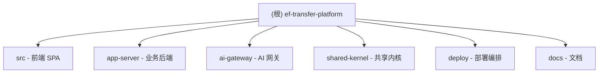

# EF.Transfer Platform (华仕2)

> English-French lexical transfer learning platform -- 英法词汇迁移学习平台

## 项目愿景

面向英法双语学习者（学生）和教学者（教师），提供基于词汇迁移理论的智能诊断、个性化训练、学情分析和 AI 辅助教学的全链路学习平台。平台通过诊断学生在英法词汇迁移中的负迁移风险，生成个性化训练计划，并借助 RAG（检索增强生成）技术提供词汇知识的深度解释。

## 架构总览

全栈 Monorepo 架构，包含前端 SPA、业务后端服务和 AI 网关三层。

- **前端 (src/)**: React 19 + TypeScript + Vite + TailwindCSS + React Query + Zustand
- **业务后端 (app-server/)**: Spring Boot 4.0 + MyBatis-Plus + MySQL + Redis + RabbitMQ + JWT 鉴权
- **AI 网关 (ai-gateway/)**: Spring Boot 3.5 + Spring AI + PgVector + Resilience4j + Qwen Provider
- **共享内核 (shared-kernel/)**: 跨服务共享的枚举、DTO、事件契约、API 响应结构
- **部署 (deploy/)**: Docker Compose 编排全部基础设施（MySQL、Redis、RabbitMQ、PostgreSQL+pgvector）

技术栈要点：
- Java 25, Maven (含 Wrapper), JUnit 5
- Node.js 20+, npm, TypeScript 5.6, Vite 6
- Flyway 数据库迁移（app-server: MySQL, ai-gateway: PostgreSQL）
- RabbitMQ 用于跨服务事件（词汇知识变更 -> ai-gateway 定向重建索引）
- 内部 API 统一 Token 鉴权 (`X-Internal-Token`)

## 模块结构图



## 模块索引

| 模块 | 路径 | 语言 | 职责 | 入口 | 测试 |
|------|------|------|------|------|------|
| 前端 SPA | `src/` | TypeScript/React | 学生/教师/管理员三端界面、路由鉴权、API 对接 | `src/main.tsx` | 32 测试文件（Vitest） |
| 业务后端 | `app-server/` | Java | 认证授权、词汇管理、诊断、训练、分析、AI 调度、运维配置 | `AppServerApplication` | 43 测试类 |
| AI 网关 | `ai-gateway/` | Java | AI Provider 集成、RAG 检索/Rerank、向量存储、知识同步 | `AiGatewayApplication` | 12 测试类 |
| 共享内核 | `shared-kernel/` | Java | 跨服务枚举、DTO 契约、事件定义、分页/响应结构 | 无独立入口（库） | 无 |
| 部署编排 | `deploy/` | YAML/Docker | Docker Compose 编排 7 个服务（含 frontend）+ 5 个命名卷 | `docker-compose.yml` | N/A |

## 运行与开发

### 前提条件

- JDK 25
- Node.js 20+
- MySQL / Redis / RabbitMQ / PostgreSQL 已启动（可用 Docker Compose）

### 快速启动

```bash
# 1. 启动基础依赖
cd deploy
cp .env.example .env   # 编辑填入必要密钥
docker compose --env-file .env up -d mysql redis rabbitmq postgres

# 2. 启动 ai-gateway
./mvnw -pl ai-gateway -am spring-boot:run

# 3. 启动 app-server
./mvnw -pl app-server -am spring-boot:run

# 4. 启动前端
npm install
npm run dev   # -> http://localhost:3000
```

### 必填环境变量

- `APP_JWT_SECRET` -- JWT 签名密钥
- `PLATFORM_INTERNAL_API_TOKEN` -- 内部 API 统一令牌
- `AI_OPENAI_API_KEY` / `AI_OPENAI_BASE_URL` -- AI Provider 密钥与端点
- `AI_CHAT_MODEL` / `AI_EMBEDDING_MODEL` / `AI_RERANK_MODEL` -- AI 模型名

### 健康检查

- `http://localhost:8080/api/health` -- app-server 健康
- `http://localhost:8080/actuator/health` -- app-server actuator
- `http://localhost:8090/actuator/health` -- ai-gateway actuator
- `http://localhost:8090/internal/ai/health` -- ai-gateway 内部健康（需 `X-Internal-Token`）

### 验证命令

```bash
npm run lint          # ESLint
npm run typecheck     # TypeScript 类型检查
npm run build         # 前端构建
./mvnw test           # 后端全量测试
npm run build:analyze # 构建分析报告
```

## 测试策略

- **app-server**: 集成测试为主（H2 内存数据库，`MODE=MySQL`），覆盖 auth、security、lexicon、diagnosis、training、analytics、ai、opsconfig、assessment、notification、achievement、user、internal、audit、health、support 等模块，共 43 个测试类
- **ai-gateway**: 集成测试（Testcontainers PostgreSQL + pgvector）+ WireMock 外部服务模拟，覆盖 provider、rag、config、health、security 模块，共 12 个测试类
- **前端**: Vitest + Testing Library + jsdom，当前共 32 个测试文件（routing、API、services、i18n、assessment、teacher-workspace、pages 级组件等）；入口 `src/test/setup.ts`
- **数据库迁移**: app-server 31 个 Flyway 迁移脚本（V1-V31，MySQL），ai-gateway 5 个迁移脚本（V1-V5，PostgreSQL + pgvector）

## 编码规范

### 前端

- TypeScript strict mode（noUnusedLocals, noUnusedParameters, noFallthroughCasesInSwitch）
- ESLint 9 + eslint-plugin-react-hooks + eslint-plugin-react-refresh
- TailwindCSS 工具类优先，自定义 CSS 变量主题系统（支持 dark mode）
- 路由使用 `React.lazy` 页面级懒加载
- 图表统一走 `src/lib/echarts.ts`（echarts/core 按需注册）
- Vite 手动分包策略（react-vendor, app-vendor, ui-vendor, chart-engine, chart-renderer）
- API 调用统一走 `src/lib/services.ts` -> `src/lib/api.ts`（含 401 自动刷新 token）
- 状态管理：Zustand（auth store + UI store），服务端状态用 React Query
- 路径别名：`@` -> `./src`

### 后端

- Java 25, Maven multi-module
- Spring Boot 分 profile 配置（local/dev/prod）
- MyBatis-Plus 分页 + Lambda 查询
- Flyway 管理数据库迁移，不手动修改已发布迁移脚本
- 统一响应结构 `ApiResponse<T>` + `ResultCode` + `BusinessException`
- JWT + Redis 实现 access/refresh token 机制
- RabbitMQ 仅用于跨服务事件（不用作本地 analytics 总线）
- 内部 API 鉴权使用 `X-Internal-Token` 请求头

## AI 使用指引

- 代码修改时注意前后端契约对齐（`src/lib/contracts.ts` 与 `shared-kernel` 中的 VO/DTO）
- 新增 API 端点需同步更新 `src/lib/services.ts`
- 新增数据库表需新增 Flyway 迁移脚本，版本号递增
- ai-gateway 和 app-server 共享 `shared-kernel` 依赖，修改枚举/事件需同步两端
- 环境变量修改需同步 `deploy/.env.example` 和 `deploy/docker-compose.yml`
- 诊断和训练 session 同一用户仅允许一个 IN_PROGRESS 状态
- 前端权限基于 `capabilities`（非 `primaryRole`），修改角色/权限需检查 `App.tsx` 路由守卫

## 变更记录 (Changelog)

| 时间 | 操作 | 说明 |
|------|------|------|
| 2026-03-22 00:35:46 | 初始创建 | 全仓扫描生成，覆盖 5 个模块 |
| 2026-04-18 | 文档同步 | 同步实际测试/迁移/服务计数（见 `docs/review-2026-04-18.md`）：前端 0→32、app-server 23→43、ai-gateway 11→12；Flyway app-server V1-V9→V1-V31、ai-gateway V1-V4→V1-V5；Compose 服务数 6→7（含 frontend） |
