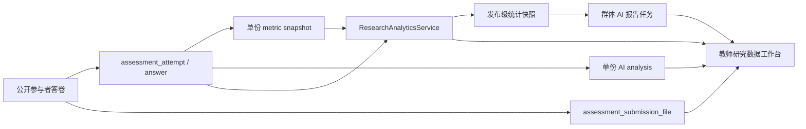

# 研究问卷数据闭环、附件与 AI 报告实施计划

> 面向执行 Agent 的工程交付文档。实施目标是补齐教师端公开研究问卷的答卷查看、附件查看、统计分析和 LLM 报告能力，同时保持匿名研究、课堂测评与现有学生结果页兼容。

## 1. 目标与完成定义

完成后，教师应能从 `/teacher/research?tab=data` 完成以下工作：

1. 选择自己有权限的研究问卷发布批次。
2. 查看邀请数、进入数、提交数、完成率、中途退出数、平均用时和 AI 分析状态。
3. 按状态、参与方式、提交时间、数据质量和关键词筛选参与者答卷。
4. 打开单份匿名答卷，查看题目、学生回答、作答时间、质量标记、附件及单份 AI 解读。
5. 查看题目难度、选项/干扰项分布、维度正确率、反应时分布和数据质量分布。
6. 生成和查看基于固定统计快照的群体 LLM 研究报告，清楚区分事实统计与模型解读。
7. 导出脱敏 CSV/XLSX；附件必须通过鉴权下载，不能暴露底层存储地址。

完成标准不是“页面出现图表”，而是：统计口径可追溯、公开答卷权限正确、空/错/加载状态完整、桌面和移动端可用、接口与 UI 有自动化测试。

## 2. 已确认的现状与根因

### 2.1 已有能力

- PUBLIC_CODE 问卷发布、参与码、二维码进入、匿名 participant session 已存在。
- 提交时已经生成 `assessment_metric_snapshot`。
- 提交时已经创建 `assessment_ai_analysis`，后台处理器会调用真实模型并提供规则降级。
- 学生公开结果页已经可以显示单份指标、质量标记和 AI 分析。
- 教师课堂测评已有发布详情、名单表格和单份答卷详情，可复用视觉模式但不能直接复用其班级身份假设。

### 2.2 必须修复的结构问题

- `ResearchAssessments.tsx` 的数据页是静态占位，没有统计查询。
- 公开答卷以 `participant_id` 归属，教师单份答卷服务仍要求 `student_user_id` 和 `teaching_class_id`。
- 公开发布管理只返回参与码计数，不返回参与者/答卷列表。
- `TeacherAssessmentAttemptResultVO` 没有单份指标、质量标记和 AI 分析。
- 没有发布级统计快照或聚合查询服务。
- 没有群体 AI 报告实体、任务状态、快照版本和教师查询接口。
- 当前题型和响应协议没有真实文件上传能力。

## 3. 范围与非目标

### 本期范围

- 公开研究问卷答卷列表和单份详情。
- 发布级、题目级、维度级和反应时统计。
- 单份 AI 分析的教师可见性。
- 群体 LLM 报告的生成、轮询、失败/降级和版本留存。
- 学生文件上传、教师安全预览/下载、导出清单。
- 数据隐私、审计、最小样本阈值和敏感字段隔离。
- 完整前端信息架构和视觉/交互质量。

### 非目标

- 不重写现有公共作答页面。
- 不把公开参与者强制转换为平台学生账号。
- 不将附件原文默认发送给 LLM。
- 不在本期建设通用 BI 自助查询系统。
- 不允许前端自行计算权威统计后当作正式报告数据。

## 4. 关键产品与数据决策

执行 Agent 开工前必须遵守以下默认决策；若产品负责人改变决策，再调整契约。

### 4.1 参与者身份

- 公开研究答卷的主身份是 `participant_id`，不是 `student_user_id`。
- 教师界面默认显示稳定匿名编号，例如 `P-000137`。
- 姓名、邮箱、联系方式等资料题属于敏感回答，不得用作列表默认列，也不得进入普通导出。
- 管理员不自动拥有查看敏感答案的业务权限；权限仍按研究问卷所有者与显式 capability 校验。

### 4.2 完成率口径

- `eligibleCount = participationCodeCount + qrParticipantCount` 不能直接作为所有场景的统一分母，因为二维码免码参与没有预生成总人数。
- 页面同时展示两个漏斗：
  - 邀请码漏斗：已生成有效码、已进入、已提交。
  - 实际会话漏斗：已创建参与者、作答中、已提交、超时/放弃。
- 主要“完成率”定义为 `submittedAttemptCount / startedAttemptCount`。
- 邀请码兑换率单独定义为 `verifiedCodeCount / nonRevokedCodeCount`。
- 每个比率接口必须同时返回 numerator、denominator 和 value；分母为 0 时返回 `null`，前端显示 `—`。

### 4.3 题目统计

- 题目难度：`correctCount / validAnsweredCount`，不使用所有进入者作分母。
- 跳过率：`unansweredSubmittedCount / submittedAttemptCount`。
- 选项分布：每个 option 返回 count、answeredShare、submittedShare。
- 多选题必须同时提供“选项选择率”和“整题完全正确率”。
- 反应时只统计有效 timing 样本，并返回 sampleCount、median、Q1、Q3、P90；异常值规则与质量标记版本化。
- 自由文本不做自动正确率；只提供回答数、空答数和人工/模型主题分析状态。

### 4.4 AI 报告

- 单份 AI 分析继续使用现有 `assessment_ai_analysis`。
- 群体报告必须基于不可变的统计快照，而不是生成时临时读取不断变化的数据。
- 报告页面必须把“统计事实”和“模型解读”分区展示。
- 模型输入默认只包含聚合数据、匿名题号、题干摘要和脱敏主题样本；禁止包含姓名、邮箱、手机号、IP、参与码和附件原文。
- 默认最小样本量为 5；低于阈值不允许生成群体模型报告，只显示规则统计。
- 每份报告保存 promptVersion、model、统计快照 ID、样本量、质量限制、生成来源和时间。

### 4.5 附件

- 新增独立 `FILE_UPLOAD` 题型，不把 base64、对象 URL 或文件名塞进 `responses` 字符串。
- 文件先上传为临时对象，再通过保存答案接口绑定到 attempt/question；提交后锁定。
- 默认限制：单文件 20 MB、每题最多 5 个、每份问卷最多 50 MB。
- 初始允许 PDF、DOCX、XLSX、CSV、TXT、PNG、JPG；服务端同时校验扩展名、Content-Type 和文件签名。
- 底层使用可替换 `ObjectStorageService`；数据库只存 objectKey、原始文件名、大小、MIME、SHA-256、扫描状态。
- 下载使用短时签名或后端流式响应，并再次校验教师对 paper/publish 的访问权。
- 病毒扫描未通过前不可预览或下载；扫描失败显示明确状态。

## 5. 目标架构



## 6. 数据库设计

项目当前以 schema 快照初始化，不新增历史迁移目录。必须同步修改：

- `app-server/src/main/resources/schema.sql`
- `app-server/src/test/resources/schema-h2.sql`

### 6.1 `assessment_submission_file`

建议字段：

| 字段 | 类型 | 说明 |
|---|---|---|
| id | bigint | 主键 |
| attempt_id | bigint | 所属答卷 |
| answer_id | bigint nullable | 保存答案后绑定 |
| question_id | bigint | 所属题目 |
| participant_id | bigint nullable | 公开参与者 |
| student_user_id | bigint nullable | 登录学生 |
| upload_token | varchar(64) | 临时上传绑定令牌，唯一 |
| original_file_name | varchar(255) | 原始文件名，仅授权查看 |
| storage_provider | varchar(32) | LOCAL/S3/OSS/MINIO |
| object_key | varchar(512) | 不对前端暴露 |
| mime_type | varchar(128) | 服务端检测结果 |
| file_extension | varchar(32) | 归一化扩展名 |
| size_bytes | bigint | 文件大小 |
| sha256 | char(64) | 完整性与去重依据 |
| scan_status | varchar(32) | PENDING/CLEAN/INFECTED/FAILED |
| binding_status | varchar(32) | TEMPORARY/BOUND/ORPHANED/DELETED |
| uploaded_at | timestamp | 上传时间 |
| bound_at | timestamp nullable | 绑定时间 |
| deleted_at | timestamp nullable | 逻辑删除时间 |

索引：

- `(attempt_id, question_id, binding_status)`
- `(upload_token)` unique
- `(sha256, size_bytes)`
- `(scan_status, uploaded_at)`

### 6.2 `research_aggregate_snapshot`

保存生成群体报告时使用的不可变统计输入。

建议字段：publish_id、paper_id、snapshot_version、filter_json、sample_count、submitted_count、statistics_json、quality_summary_json、source_max_updated_at、created_at、created_by。

唯一键建议使用 `(publish_id, snapshot_version, source_max_updated_at)` 或业务生成的 `snapshot_key`。

### 6.3 `research_ai_report`

建议字段：

- publish_id、aggregate_snapshot_id
- prompt_version、idempotency_key
- status：PENDING/PROCESSING/COMPLETED/FALLBACK/FAILED
- retry_count、next_retry_at
- model_name、prompt_tokens、completion_tokens
- report_json、rule_fallback_json、raw_response
- fallback_reason、generation_record_id
- requested_by、requested_at、completed_at

唯一键：`(aggregate_snapshot_id, prompt_version)`。

### 6.4 可选审计事件

附件预览、下载、敏感导出和群体报告生成必须写现有 `audit_log`。建议 action type：

- `RESEARCH_RESPONSE_VIEWED`
- `RESEARCH_ATTACHMENT_DOWNLOADED`
- `RESEARCH_SENSITIVE_EXPORT_CREATED`
- `RESEARCH_AI_REPORT_REQUESTED`
- `RESEARCH_AI_REPORT_VIEWED`

## 7. 后端模块与接口计划

建议在现有 assessment 模块内建立 `research` 子包或清晰命名的服务，避免继续把所有逻辑堆入 `AssessmentService`。

### 7.1 权限解析器

新增 `ResearchAccessService`：

- `requireAccessibleResearchPublish(publishId)`
- `requireAccessibleResearchAttempt(attemptId)`
- `requireAccessibleResearchFile(fileId)`
- 校验 paper purpose 为 `RESEARCH_SURVEY`、delivery mode 为 `PUBLIC_CODE`、当前教师是 paper owner；管理员行为按现有规则明确处理。
- 不调用 `requireTeachingClass()`。

### 7.2 教师发布概览

`GET /api/teacher/research/releases`

返回轻量选择器数据：publishId、paperId、paperTitle、releaseCode、publishedAt、status、startedCount、submittedCount、latestSubmissionAt、aiReportStatus。

不要让数据页继续通过 `listTeacherPapers()` 猜测发布状态。

### 7.3 发布级总览

`GET /api/teacher/research/publishes/{publishId}/overview`

返回：

- funnel：codeGenerated、codeVerified、participantCreated、attemptStarted、inProgress、submitted、expired。
- rates：completionRate、codeRedemptionRate、submissionRate，每项含 numerator/denominator/value。
- timing：medianCompletionMs、Q1、Q3、sampleCount。
- score：average、median、Q1、Q3、sampleCount。
- dataQuality：valid、flagged、flag distribution。
- ai：pending、processing、completed、fallback、failed。
- latestSubmissionAt、statisticsGeneratedAt。

### 7.4 答卷列表

`GET /api/teacher/research/publishes/{publishId}/attempts`

查询参数：pageNo、pageSize、status、entryType、qualityFlag、aiStatus、submittedFrom、submittedTo、keyword、sort。

返回行字段：

- attemptId、participantCode、participantType
- status、answeredCount、questionCount
- percentageScore、effectiveDurationMs
- qualityFlags、attachmentCount
- aiAnalysisStatus
- startedAt、lastSavedAt、submittedAt

`keyword` 只搜索匿名编号和经批准可搜索的非敏感业务字段；不能搜索参与码明文、IP 或敏感资料答案。

### 7.5 单份答卷详情

`GET /api/teacher/research/attempts/{attemptId}`

返回独立 `TeacherResearchAttemptDetailVO`，不要强行扩展课堂 `TeacherAssessmentAttemptResultVO`：

- participant：匿名编号、进入方式、consentedAt。
- attempt：状态、进度、开始/保存/提交时间、提交原因。
- result：分数、metricSnapshot、qualityFlags。
- ai：status、analysis、modelName、completedAt、fallbackReason。
- questions：题目快照、回答、正确答案、得分、justification、effectiveDurationMs、responseChangeCount、attachments。
- sensitiveProfile：默认不返回；如业务确需查看，使用单独 capability 和单独接口。

### 7.6 统计接口

拆分接口，便于 React Query 独立加载和失败隔离：

- `GET .../statistics/questions`
- `GET .../statistics/options`
- `GET .../statistics/dimensions`
- `GET .../statistics/reaction-times`
- `GET .../statistics/quality`
- `GET .../statistics/text-themes`

所有接口接受统一过滤器，并返回 `filterEcho`、`sampleCount`、`generatedAt`、`metricVersion`。

题目统计行至少包含：questionId、questionOrder、questionCode、sectionTitle、questionType、answeredCount、skippedCount、correctRate、medianReactionMs、qualityWarning。

### 7.7 导出

- `POST /api/teacher/research/publishes/{publishId}/exports`
- 请求中明确 format、scope、filters、includeSensitiveFields、includeAttachmentManifest。
- 默认异步生成，返回 jobId；小数据量也保持统一契约。
- 普通导出不得含 IP、参与码明文、姓名、联系方式和附件底层地址。
- 附件只导出文件清单和受控下载入口，不打包到 CSV。

### 7.8 文件上传与下载

公共侧：

- `POST /api/public/assessments/{releaseCode}/files/initiate`
- `POST /api/public/assessments/{releaseCode}/files/{uploadToken}/content`，或对象存储直传方案。
- `DELETE /api/public/assessments/{releaseCode}/files/{uploadToken}`，仅答卷提交前。
- 保存答案时 `AssessmentAttemptResponseRequest` 增加 `attachmentTokens`，只对 FILE_UPLOAD 题型有效。

教师侧：

- `GET /api/teacher/research/files/{fileId}/metadata`
- `GET /api/teacher/research/files/{fileId}/download`
- PDF/图片可增加受控 preview；Office 文件首期只下载，不在服务端进行不可信格式转换。

必须处理：上传中断、重复绑定、跨 attempt token 使用、提交后删除、超限、恶意 MIME、扫描失败、孤儿临时文件清理。

### 7.9 群体 AI 报告

- `POST /api/teacher/research/publishes/{publishId}/ai-reports`
- `GET /api/teacher/research/publishes/{publishId}/ai-reports/latest`
- `GET /api/teacher/research/ai-reports/{reportId}`
- `POST /api/teacher/research/ai-reports/{reportId}/retry`

生成流程：

1. 校验权限与最小样本量。
2. 按当前过滤器生成不可变 aggregate snapshot。
3. 以 snapshotId + promptVersion 建幂等任务。
4. 后台 worker 读取快照，构造脱敏结构化输入。
5. 校验模型 JSON schema；失败按配置重试，最终生成规则降级报告。
6. 前端轮询或按现有异步任务模式刷新。

建议报告结构：

- executiveSummary
- observedPatterns[]
- dimensionFindings[]
- difficultQuestions[]
- distractorFindings[]
- reactionTimeFindings[]
- dataQualityLimitations[]
- researchCautions[]
- recommendedNextAnalyses[]
- confidence

禁止让模型输出因果结论；文案应使用“观察到相关模式”“不能据此推断”。

## 8. 前端信息架构与质量标准

### 8.1 页面路由

保留 `/teacher/research?tab=data` 作为数据总入口，并增加：

- `/teacher/research/publishes/:publishId/data`
- `/teacher/research/attempts/:attemptId`
- `/teacher/research/publishes/:publishId/report`

入口页在选择发布后可同步 URL 参数 `publishId`，刷新和分享链接时保持上下文。

### 8.2 数据工作台结构

页面顺序必须稳定：

1. `PageHeader`：标题、说明、发布选择器、导出按钮。
2. 数据范围条：发布名称、时间范围、过滤条件、最后更新时间、清除筛选。
3. 核心指标卡：已开始、已提交、完成率、有效样本、平均/中位分、平均/中位用时。
4. 漏斗区：参与码或实际会话漏斗，口径文字始终可见。
5. 图表区：维度表现、题目难度、干扰项、反应时、质量标记。
6. 答卷表：分页、筛选、排序、打开详情。
7. AI 报告卡：状态、样本量、快照时间、查看/生成/重试。

### 8.3 组件拆分

建议目录：

```text
src/features/research-analytics/
  api.ts
  queryKeys.ts
  types.ts
  formatters.ts
  chartOptions.ts
  filters.ts
  components/
    ResearchReleasePicker.tsx
    ResearchFilterBar.tsx
    ResearchMetricGrid.tsx
    ResearchFunnel.tsx
    QuestionDifficultyTable.tsx
    OptionDistributionChart.tsx
    DimensionPerformanceChart.tsx
    ReactionTimeChart.tsx
    QualityFlagPanel.tsx
    ResearchAttemptTable.tsx
    ResearchAiReportCard.tsx
    ResearchDataDisclosure.tsx
```

页面文件只负责布局和查询编排，不在 JSX 中内联数百行图表 option 或统计计算。

### 8.4 现有设计系统复用

- 使用 `PageHeader`、`SectionEyebrow`、`ChartCard`、`FeedbackState`、`DataTable`、`Pagination`、`StatusBadge`、`ConfirmationDialog`。
- 保持 `page-stack`、`liquid-glass-panel`、现有 primary/emerald/amber/rose 色义。
- 图标使用 `lucide-react`，图表使用现有 ECharts 封装。
- 禁止引入第二套表格、图表、按钮或弹窗库。
- 禁止用 emoji、手写 SVG、字符图标代替产品图标。

### 8.5 指标卡标准

- 卡片必须包含指标名、值、单位、口径/分母提示。
- `null` 显示 `—`，不能显示 `0%` 误导用户。
- 数据不足、过滤后为空、接口失败必须是不同状态。
- 与上次快照的变化只有后端返回可比较基线时才显示。

### 8.6 图表标准

- 所有图表标题下方写明横纵轴含义、单位和样本量。
- 颜色不能作为唯一编码；同时使用标签、图例或形状。
- tooltip 显示 count、rate、denominator，不能只显示百分比。
- 排名型图表默认按问题顺序或难度排序，并提供切换。
- 长题干使用截断加 tooltip/展开，不挤压图表。
- 样本量过小时显示提示，不渲染看似精确的趋势。
- 图表 loading、error、empty 使用 `ChartCard` 的统一反馈状态。

### 8.7 答卷表标准

桌面列：参与者、状态、完成进度、得分、用时、质量、附件、AI、提交时间、操作。

移动端不能仅依赖横向溢出的大表：在 `<768px` 使用紧凑卡片列表，显示参与者、状态、提交时间和最关键指标；筛选器放入可展开面板。

交互要求：

- 行点击和“查看详情”按钮行为一致，但按钮保留明确可访问名称。
- 筛选条件写入 URL；返回列表时保留页码、排序与滚动位置。
- 请求切换时保留上一份发布数据并显示轻量刷新状态，避免全页闪白。
- 导出、AI 生成等服务端动作使用明确进行中状态，防止重复提交。

### 8.8 单份答卷详情标准

布局：

- 顶部摘要：匿名参与者编号、状态、进入方式、时间线、质量标记。
- 结果摘要：分数、维度、反应时、AI 状态、附件数。
- 题目导航：按 section 分组，支持“仅看异常/仅看附件/仅看未答”。
- 每题卡片：题干、回答、正确答案、得分、解释、作答时间、修改次数和附件。
- AI 解读：复用学生端信息结构，但增加模型来源、完成时间、规则降级和证据边界。

不能在公开参与者没有学生姓名时显示“未知学生”；统一使用匿名编号。

### 8.9 AI 报告页标准

- 首屏先显示报告依据：发布、样本量、过滤器、统计快照时间、模型/规则来源。
- “统计事实”区使用图表和表格；“模型解读”区使用文本卡片。
- 明确显示低样本、缺失数据、质量标记和不可推断事项。
- PENDING/PROCESSING 使用非阻塞状态；教师仍可查看基础统计。
- FALLBACK 不使用“AI 已完成”文案，显示“规则摘要”。
- FAILED 提供错误摘要和重试按钮，不暴露 provider 原始错误或内部 prompt。
- 支持打印/PDF 应作为后续独立任务，不与首期数据闭环绑死。

### 8.10 附件 UI 标准

学生端：

- 拖放区同时提供标准文件选择按钮。
- 显示允许格式、单个与总大小限制。
- 每个文件显示名称、大小、上传/扫描/失败状态和删除操作。
- 页面离开或提交前必须等待正在上传的文件处理完成。
- 上传失败不清空其他已成功文件。

教师端：

- 每个附件显示类型、大小、扫描状态、上传时间。
- 只有 CLEAN 状态可预览/下载。
- 下载前显示审计提示；敏感文件可增加确认弹窗。
- 文件名必须转义，不能直接作为 HTML；预览禁止执行脚本内容。

### 8.11 可访问性

- 所有表单控件有可见 label；不能只依赖 placeholder。
- Tab、筛选器、分页、对话框支持键盘操作和清晰 focus ring。
- 状态变化使用适度的 `aria-live`，不能让轮询持续打断屏幕阅读器。
- 图表必须有文本摘要或对应数据表入口。
- 颜色对比满足 WCAG AA；浅灰说明文字尤其需要检查。
- 尊重 `prefers-reduced-motion`，数据刷新不做大幅入场动画。

### 8.12 响应式验收视口

至少验证：390×844、768×1024、1280×800、1440×900、1920×1080。

验收重点：无内容裁切、无不可操作的横向滚动、标题和筛选不重叠、图表 tooltip 不出屏、表格移动端有替代布局。

## 9. 前端状态与查询策略

### Query keys

```ts
researchAnalyticsKeys.releases()
researchAnalyticsKeys.overview(publishId, filters)
researchAnalyticsKeys.attempts(publishId, filters, page, sort)
researchAnalyticsKeys.questionStats(publishId, filters)
researchAnalyticsKeys.dimensionStats(publishId, filters)
researchAnalyticsKeys.reactionStats(publishId, filters)
researchAnalyticsKeys.aiReport(publishId, reportId?)
researchAnalyticsKeys.attemptDetail(attemptId)
```

要求：

- 过滤对象先归一化，防止 key 因空字符串/undefined 不一致。
- 发布切换时取消旧请求。
- 列表使用 placeholder data 保持稳定；详情不显示上一位参与者数据。
- AI 状态仅在 PENDING/PROCESSING 时轮询，完成后停止。
- 下载文件不用 React Query 缓存二进制正文。

## 10. 类型契约

前后端新增命名建议：

- `ResearchReleaseListItemVO`
- `ResearchPublishOverviewVO`
- `ResearchRateVO`
- `ResearchAttemptSummaryVO`
- `TeacherResearchAttemptDetailVO`
- `ResearchQuestionStatisticVO`
- `ResearchOptionStatisticVO`
- `ResearchDimensionStatisticVO`
- `ResearchReactionTimeStatisticVO`
- `ResearchQualityStatisticVO`
- `ResearchAttachmentVO`
- `ResearchAggregateSnapshotVO`
- `ResearchAiReportVO`
- `ResearchExportJobVO`

前端 `src/lib/contracts.ts` 必须与 Java VO 同步。禁止用 `any` 或把后端枚举全部退化为无约束 string。

## 11. 测试计划

### 11.1 后端单元/集成测试

- 教师只能访问自己问卷的公开答卷。
- PUBLIC_CODE 答卷不依赖 teaching class/student user。
- 完成率各分母为 0、混合二维码和参与码、撤销码场景。
- 题目难度、多选分布、跳过率和反应时四分位数。
- 质量标记过滤和统计。
- 单份详情返回 metric/AI/附件，不泄漏 objectKey、IP、参与码明文。
- 文件跨答卷绑定、重复绑定、超限、非法 MIME、扫描失败、提交后删除。
- 群体报告最小样本限制、快照幂等、并发请求、重试和 fallback。
- AI payload 不包含敏感字段或附件原文。
- schema MySQL/H2 一致性。

### 11.2 前端测试

使用 Vitest + Testing Library，至少覆盖：

- 数据页加载、错误、真正空数据、过滤后空数据。
- 完成率为 null 时显示 `—`。
- 发布切换、URL 筛选同步、分页保留。
- 答卷表进入详情并返回保留上下文。
- AI PENDING 到 COMPLETED/FALLBACK/FAILED 的状态变化。
- 附件扫描中、可下载、阻止下载状态。
- 移动端使用卡片列表而不是不可用宽表。
- 图表同时存在可访问文本摘要。

### 11.3 端到端验收

1. 创建研究问卷并公开发布。
2. 参与码用户进入、上传附件、部分保存、恢复并提交。
3. 二维码用户提交第二份答卷。
4. 教师看到实时漏斗和答卷列表。
5. 教师打开两份答卷、下载 CLEAN 附件。
6. 样本不足时群体 AI 按规则阻止。
7. 补足样本后生成群体报告并验证快照元数据。
8. 导出普通脱敏数据，确认无敏感字段和底层 object key。

## 12. 实施阶段与 Agent 分工

以下任务应按依赖顺序执行。可以并行的任务已标注，但共享契约修改必须先合并。

### Phase 0：契约冻结与测试夹具

负责人：架构/契约 Agent

- 确认统计口径、敏感字段分类、最小样本量和附件限制。
- 创建 Java VO/DTO、TypeScript interface 草案。
- 建立包含邀请码、二维码、提交/未提交、质量标记、文件、AI 各状态的测试数据夹具。
- 输出接口示例 JSON。

验收：前后端 Agent 能在不猜字段含义的情况下独立开发。

### Phase 1：公开答卷教师访问闭环

负责人：后端 Agent A

- 新增 ResearchAccessService。
- 实现发布列表、overview、attempt list、attempt detail。
- 单份详情接入现有 metric 和 AI analysis。
- 修复公开答卷不应依赖 teaching class 的问题。
- 补权限和泄漏测试。

验收：使用真实 PUBLIC_CODE attemptId 能由问卷所有者查看，其他教师返回 403。

### Phase 2：统计聚合

负责人：后端 Agent B；可在 Phase 1 契约稳定后并行

- 实现统一过滤器和统计查询。
- 实现题目、选项、维度、反应时、质量统计。
- 加入样本量和统计版本信息。
- 对常用 publishId 查询加索引或批量 SQL，避免逐答卷 N+1。

验收：统计结果由固定测试数据精确断言；1000 份答卷查询没有明显 N+1。

### Phase 3：附件链路

负责人：存储/安全 Agent；可与 Phase 2 并行

- 新增表、对象存储抽象、上传和绑定接口。
- 新增 FILE_UPLOAD 题型及编辑器支持。
- 实现扫描状态、孤儿文件清理、教师下载鉴权与审计。
- 补公共作答页附件控件。

验收：越权下载、跨答卷绑定、恶意 MIME 和超限均被服务端拒绝。

### Phase 4：群体 AI 报告

负责人：AI 后端 Agent；依赖 Phase 2

- 新增 aggregate snapshot 和 research_ai_report。
- 定义结构化 schema、prompt 和安全 payload builder。
- 实现 worker、幂等、重试、fallback、查询接口。
- 记录 generation metadata，但不记录敏感输入。

验收：同一快照重复请求返回同一任务；失败可降级且页面能区分来源。

### Phase 5：教师前端数据工作台

负责人：前端 Agent；依赖 Phase 0，数据可用后联调

- 创建 `features/research-analytics`。
- 重构 data tab，接入发布选择、overview、图表和答卷列表。
- 新增单份答卷详情和 AI 报告页。
- 严格实现本计划第 8、9 节的前端标准。
- 为移动端提供卡片列表。

验收：所有状态、视口、键盘操作、图表文字摘要通过测试。

### Phase 6：导出、性能和综合验收

负责人：集成 Agent

- 完成脱敏导出和审计。
- 检查慢查询、分页、对象存储和 AI worker 指标。
- 执行端到端流程、视觉 QA 和回归测试。
- 更新 README/CLAUDE 变更记录和运维说明。

## 13. 给执行 Agent 的约束提示

每个 Agent 开工时应收到以下共同约束：

1. 先阅读根 `CLAUDE.md` 和目标目录的 `CLAUDE.md`。
2. 不修改无关用户变更，不做破坏性 git 操作。
3. schema 直接同步 MySQL 与 H2 快照，不创建 Flyway/Liquibase 迁移。
4. 接口改动同时更新 Java VO/DTO、`src/lib/contracts.ts`、`src/lib/services.ts` 和测试。
5. 不用前端 mock 数据掩盖缺失后端能力。
6. 不把 PUBLIC_CODE 答卷重新塞入课堂 roster 模型。
7. 不在日志、错误、URL、导出或模型输入中泄漏参与码、IP、objectKey 和敏感资料答案。
8. 前端必须复用现有组件与视觉 token，并完成移动端和无障碍状态。
9. 每个阶段提交前运行与改动相称的测试；最终运行完整验证命令。

## 14. 推荐提交拆分

1. `feat(research): add teacher public-attempt access contracts`
2. `feat(research): expose research overview and attempt APIs`
3. `feat(research): add aggregate statistics APIs`
4. `feat(research): add secure submission attachments`
5. `feat(research): add aggregate AI report pipeline`
6. `feat(web): build research analytics workspace`
7. `feat(web): add research attempt and AI report pages`
8. `test(research): add end-to-end data workflow coverage`
9. `docs(research): document privacy metrics and operations`

避免把 schema、全部后端、全部前端和测试压成一个不可审查的大提交。

## 15. 最终验证命令

```bash
npm run lint
npm run typecheck
npm run test
npm run build
./mvnw -pl app-server -am test
./mvnw test
```

另需执行研究页面多视口视觉检查，并保留以下页面截图：数据总览、过滤后列表、单份答卷、附件状态、AI 生成中、AI 完成、低样本阻止、错误状态和移动端布局。

## 16. 发布门槛

以下任一项未满足，不应发布：

- 教师可越权查看其他教师答卷或附件。
- 公开答卷详情仍依赖 teaching class/student user。
- 页面完成率口径没有分母说明。
- AI 报告输入包含敏感资料或附件原文。
- 规则 fallback 被标记成真实模型结论。
- 文件下载暴露 objectKey 或永久公网 URL。
- 移动端只能通过大范围横向滚动操作答卷表。
- 空数据、过滤为空和接口失败使用同一提示。
- 统计接口存在逐答卷 N+1 查询。
- MySQL 与 H2 schema 不一致。

