# Dogfood Report: ef-transfer-platform

| Field | Value |
|-------|-------|
| **Date** | 2026-04-25 |
| **App URL** | http://127.0.0.1:3000 |
| **Session** | systematic-qa-2026-04-25 |
| **Scope** | 三角色全链路系统测试，覆盖门禁基线、认证/权限、学生/教师/管理员主流程、横切 UI/控制台/响应式检查 |

## Summary

| Severity | Count |
|----------|-------|
| Open Critical | 0 |
| Open High | 0 |
| Open Medium | 0 |
| Open Low | 0 |
| Fixed In Revalidation | 6 |
| **Current Open Total** | **0** |

## Gate Status

- Frontend lint: passed with 7 warnings, 0 errors
- Contract check: passed
- OpenAPI integration test: passed via temporary JDK container (`./mvnw -pl app-server -am -Dtest=ApiDocumentationSecurityIntegrationTest -Dsurefire.failIfNoSpecifiedTests=false -DforkCount=1 -DreuseForks=false test`), `Tests run: 2, Failures: 0, Errors: 0, Skipped: 0`
- Browser matrix: completed for this deep-dive round
- Frontend production rebuild: passed
- App-server production image rebuild: passed and container returned to `healthy`

## Notes

- 测试环境：本地 Docker Compose，生产前端入口
- 允许可逆写操作；测试造数统一使用 `QA-SYS-20260425-*`
- 证据目录：`screenshots/`、`videos/`
- OpenAPI 门禁最终结果以 `app-server/target/surefire-reports/TEST-com.huashi.eftransfer.app.modules.auth.ApiDocumentationSecurityIntegrationTest.xml` 为准；该次执行时间戳为 `2026-04-25 22:11:43 +0800`
- `ISSUE-006` 已在代码定位阶段复核撤回：此前使用 `agent-browser` 直接点击了未滚动进可视区的按钮，导致假阳性；补充 `scrollintoview` 后，学生测评结果入口可正常跳转
- 本报告下半部分保留的是首轮发现问题时的原始取证；它们不再代表当前开放缺陷状态

## Revalidation After Fixes

- `ISSUE-001` 已修复：`admin.qa` 当前从登录页默认进入 `/admin/dashboard`，不再落到学生设置页。
  Evidence: 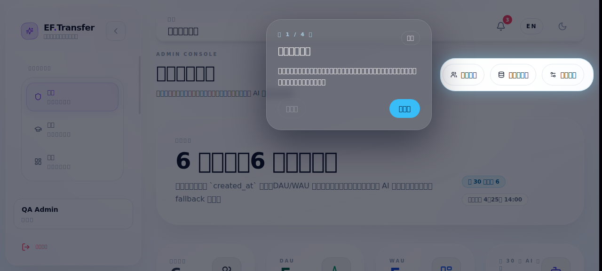

- `ISSUE-002` 已修复：教师新建班级可以稳定提交并进入详情页。本轮新增验证班级为 `QA-SYS-20260425-班级D`。
  Evidence: 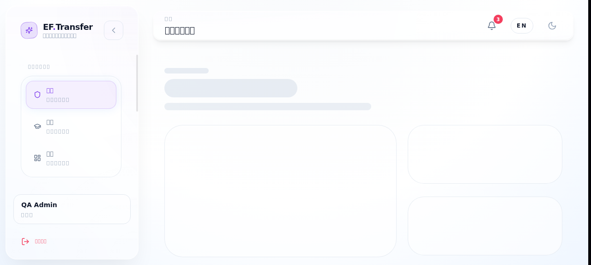

- `ISSUE-003` 已修复：教师通知面板中的学生姓名已恢复为正常中文，当前展示为 `李华`。
  Evidence: 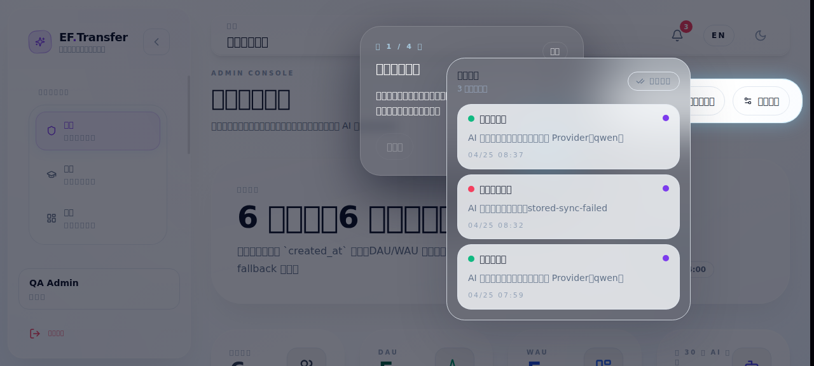

- `ISSUE-004` 已修复：教师从通知项点击后可以进入对应测评结果页，本轮复测落到 `/teacher/assessments/attempts/8/result`。
  Evidence: 

- `ISSUE-005` 已修复：管理员默认 `邀请链接` 模式创建用户成功，不再被隐藏的 `initialPassword` 校验拦截。本轮实际创建了 `qa.invite.20260425`。

- `ISSUE-007` 已修复：配置中心现在显式按 provider 分组，页面文本已明确出现 `Provider Definition / qwen / ACTIVE / FALLBACK / 展开查看 Chat / Embedding / Rerank 详细配置` 等标题，不再是无语义的连续长表单。
  Evidence: 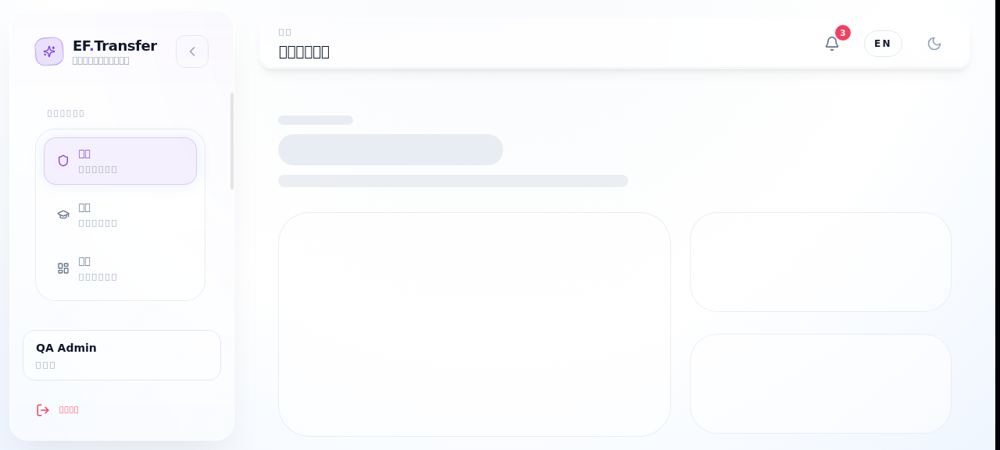

- 当前这份系统测试报告中的浏览器问题已全部收敛到 `0` 条开放项。

## Historical Issue Records

以下条目保留首轮问题发现时的原始描述、步骤和截图，用于追溯。它们已在上面的复测中确认修复，不代表当前开放状态。

### ISSUE-001: 管理员登录后默认落到学生设置页，而不是管理控制台

| Field | Value |
|-------|-------|
| **Severity** | high |
| **Category** | functional / ux |
| **URL** | `http://127.0.0.1:3000/login` -> `http://127.0.0.1:3000/settings` |
| **Repro Video** | N/A（当前环境缺少 `ffmpeg`，已改用逐步截图取证） |

**Description**

使用 `admin.qa` 登录后，系统没有把管理员带到 `/admin/dashboard`，而是落到 `/settings`。该页面同时展示了学生资料字段（年级、学号、英语水平、法语水平、课程阶段），这会让管理员首屏进入错误工作空间，并误导为需要补学生资料后才能继续操作。

**Repro Steps**

1. 打开登录页 `http://127.0.0.1:3000/login`
   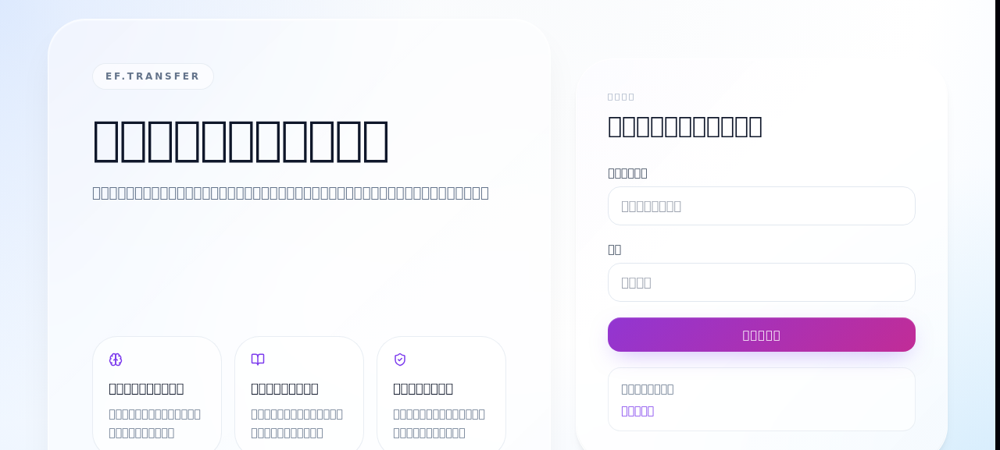

2. 输入 `admin.qa / QaAdmin@123456`
   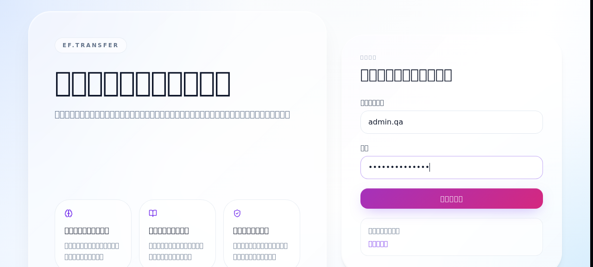

3. 点击“进入工作台”并等待页面跳转完成
   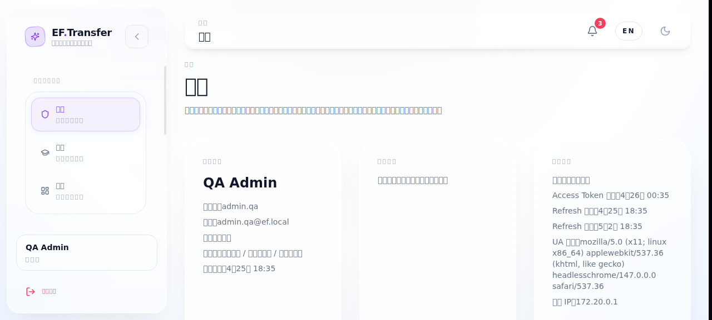

4. **Observe:** 浏览器地址停在 `/settings`，页面标题为“设置”，同时出现学生资料字段，而不是管理员仪表盘
   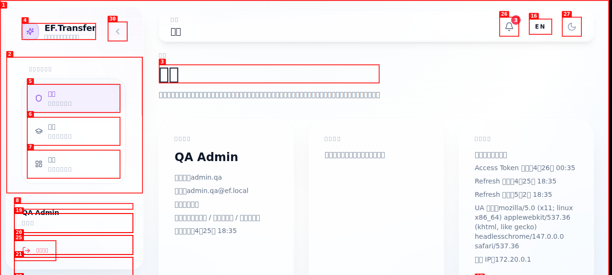

---

### ISSUE-002: 教师填写合法班级信息后，点击“保存班级”没有创建结果

| Field | Value |
|-------|-------|
| **Severity** | high |
| **Category** | functional |
| **URL** | `http://127.0.0.1:3000/teacher/classes/new` |
| **Repro Video** | N/A（当前环境缺少 `ffmpeg`，已改用逐步截图取证） |

**Description**

教师进入“新建班级”页面后，填写有效的班级名称和年级信息，`保存班级` 按钮会变成可点击状态，但点击后页面没有成功反馈，也没有跳转到班级列表或详情。随后回到班级列表，页面仍只显示原有班级，看不到刚刚输入的 `QA-SYS-20260425-班级B`，说明班级创建没有完成。

**Repro Steps**

1. 以 `teacher.zhang / Teacher@123456` 登录后，打开 `/teacher/classes/new`，填写合法班级名称和年级
   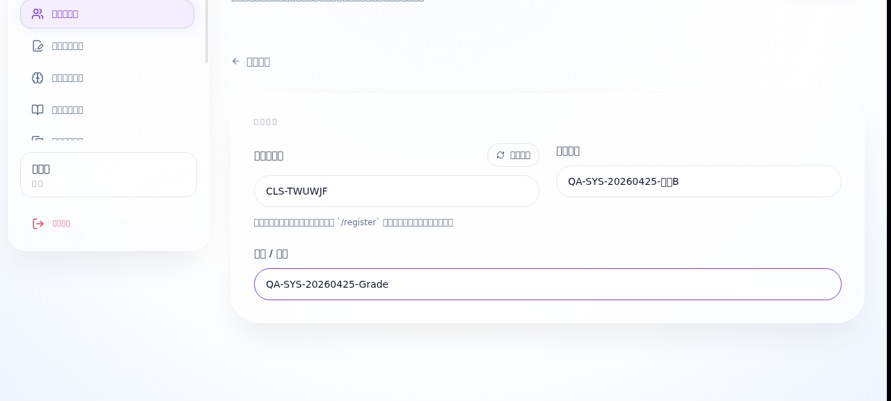

2. 验证 `保存班级` 在填完字段后已变为可点击状态
   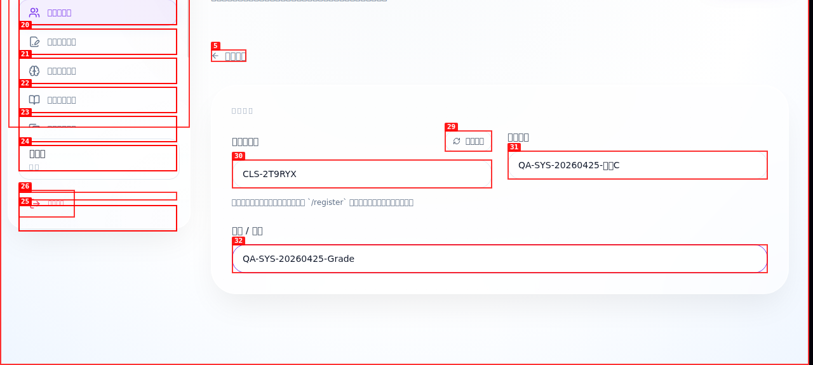

3. 点击“保存班级”并等待页面处理完成，页面仍停留在新建页，没有成功提示
   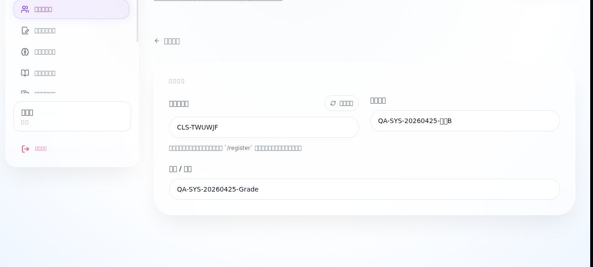

4. **Observe:** 返回班级列表后，仍然只看到原有班级，没有新建出的 `QA-SYS-20260425-班级B`
   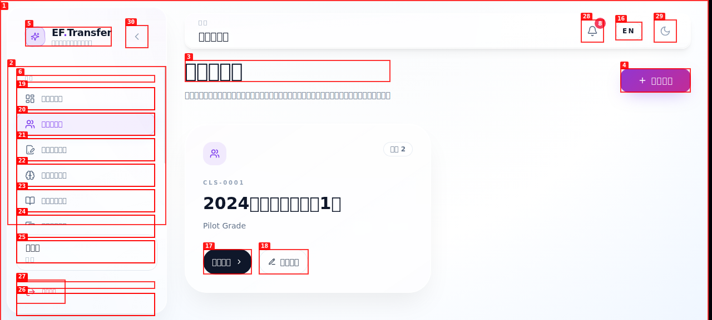

---

### ISSUE-003: 教师通知面板中的学生姓名仍然显示乱码

| Field | Value |
|-------|-------|
| **Severity** | medium |
| **Category** | content / functional |
| **URL** | `http://127.0.0.1:3000/teacher/workspace` |
| **Repro Video** | N/A（静态可见问题） |

**Description**

教师工作台主体区域里的中文已经正常，但打开通知面板后，学生姓名 `李华` 仍显示成 `李华`。这说明通知链路仍在消费或展示错误编码的数据，与其他页面的中文修复状态不一致。

**Repro Steps**

1. 以 `teacher.zhang / Teacher@123456` 登录并进入教师工作台
   

2. 点击右上角“打开通知 (8)”

3. **Observe:** 通知列表中的学生姓名显示为 `李华`，而不是 `李华`
   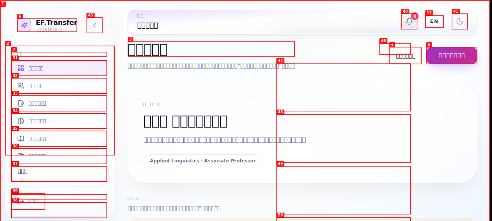

---

### ISSUE-004: 教师点击通知项后不会跳到对应测评结果页

| Field | Value |
|-------|-------|
| **Severity** | medium |
| **Category** | functional / ux |
| **URL** | `http://127.0.0.1:3000/teacher/workspace` |
| **Repro Video** | N/A（当前环境缺少 `ffmpeg`，已改用逐步截图取证） |

**Description**

通知项文案明确提示“可查看作答结果”，但教师在通知面板中点击任意一条相关通知后，页面仍停留在 `/teacher/workspace`，没有跳到测评结果、发布详情或其他相关页面。这样通知只能看，不能作为工作入口使用。

**Repro Steps**

1. 以 `teacher.zhang / Teacher@123456` 登录并进入教师工作台
   

2. 打开右上角通知面板，看到“学生已提交课堂测评 … 可查看作答结果”的通知
   

3. 点击第一条通知并等待页面响应

4. **Observe:** 浏览器仍停留在 `/teacher/workspace`，没有跳到任何结果详情页
   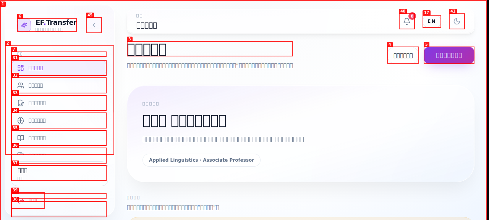

---

### ISSUE-005: 管理员按默认“邀请链接”模式创建用户时，被隐藏密码校验阻断

| Field | Value |
|-------|-------|
| **Severity** | high |
| **Category** | functional |
| **URL** | `http://127.0.0.1:3000/admin/users` |
| **Repro Video** | N/A（当前环境缺少 `ffmpeg`，已改用逐步截图取证） |

**Description**

管理员在“用户管理”页点击“新建用户”，保留默认的 `邀请链接` 创建模式，填写合法的用户名、邮箱和显示名称后提交，页面不会创建账号，而是直接显示 `initialPassword: initialPassword must be between 8 and 128 characters`。这说明默认创建模式仍被隐藏的手动密码校验拦截，导致邀请制建号链路不可用。

**Repro Steps**

1. 以 `admin.qa / QaAdmin@123456` 登录，进入 `/admin/users`，点击“新建用户”，保持默认 `邀请链接` 模式并填写合法账号信息
   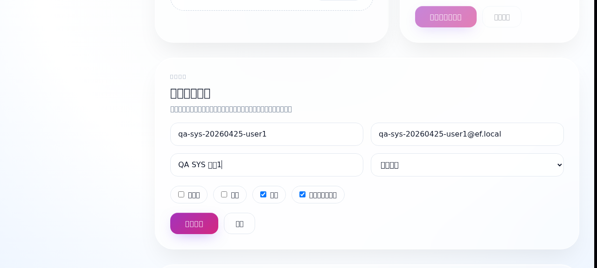

2. 点击“创建用户”

3. **Observe:** 页面顶部直接出现 `initialPassword must be between 8 and 128 characters` 校验错误，未生成账号
   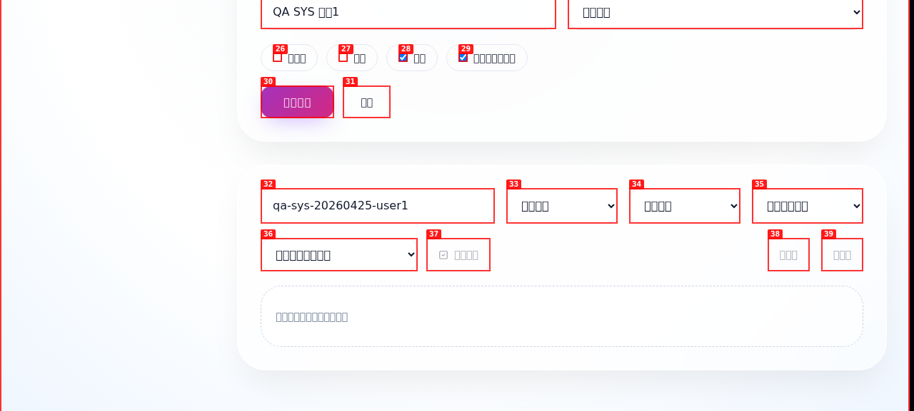

---

### ISSUE-007: 管理员配置中心把同一组模型接入配置完整渲染了两遍

| Field | Value |
|-------|-------|
| **Severity** | medium |
| **Category** | visual / ux / content |
| **URL** | `http://127.0.0.1:3000/admin/config-center` |
| **Repro Video** | N/A（静态可见问题） |

**Description**

管理员进入配置中心后，无论只读态还是编辑态，`模型接入配置` 区域都会连续渲染两套几乎完全相同的 Chat / Embedding / Rerank 表单。页面没有给出“active provider / fallback provider”之类的分组标题或解释，导致运维无法判断自己看到的是两份独立配置，还是同一份配置被重复展示。

**Repro Steps**

1. 以 `admin.qa / QaAdmin@123456` 登录并打开 `/admin/config-center`

2. **Observe:** 页面在同一屏内连续出现两套几乎相同的模型接入配置字段
   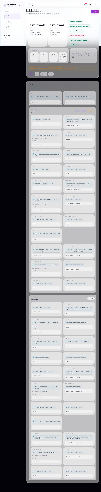

---
